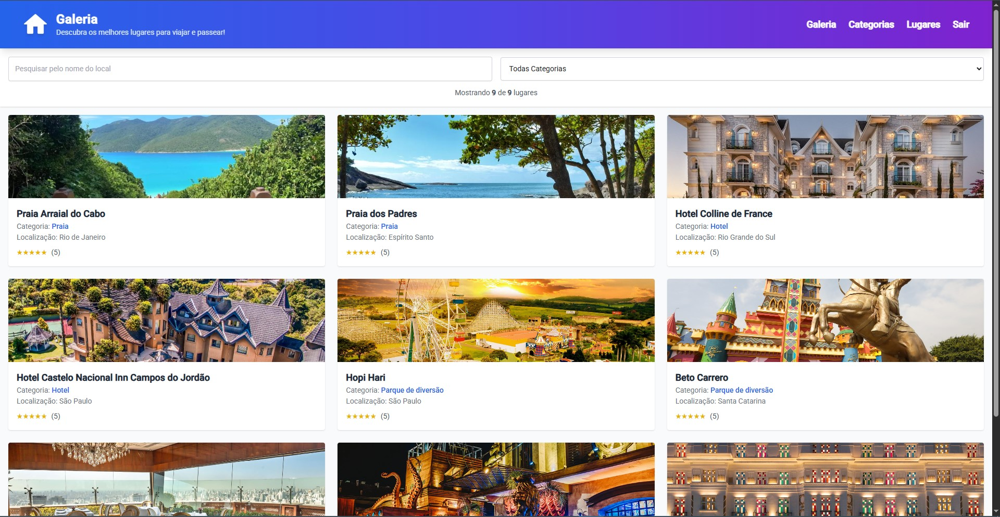

# 🌍 Travel Places - Sistema de Gerenciamento de Lugares Favoritos

<div align="center">


Uma aplicação web moderna para gerenciar e explorar seus lugares favoritos para viajar, com autenticação Google OAuth2 e interface intuitiva.

</div>

---

## 📸 Demonstração

<div align="center">

### 🏠 Landing Page


### 🖼️ Galeria de Lugares


</div>

---

## ✨ Funcionalidades

### 🔐 Autenticação & Segurança
- Login integrado com **Google OAuth2**
- Proteção de rotas com **AuthGuard**
- Sessão persistente e logout seguro

### 📍 Gerenciamento Completo
- ✅ **Criar, Editar e Excluir** lugares e categorias
- 🔍 **Filtrar** por nome e categoria em tempo real
- ⭐ **Avaliar** lugares (sistema de 1-5 estrelas)
- 📋 **Validação de formulários** em tempo real
- 🗑️ **Confirmação de exclusão** para segurança

### 🎨 Interface & UX
- Design **totalmente responsivo** (Mobile-first)
- **Sistema de notificações** colorido (Sucesso, Erro, Aviso, Info)
- **Modais interativos** para visualização e edição
- **Animações suaves** e transições elegantes
- **Filtros inteligentes** com contador de resultados

---

## 🛠️ Tecnologias

### Core
- **Angular 19** - Framework com standalone components
- **TypeScript 5.7** - Tipagem estática forte
- **RxJS 7.8** - Programação reativa

### UI/UX
- **Tailwind CSS 3.4** - Framework utility-first
- **Angular Material 19** - Material Design 3
- **Google Fonts & Icons** - Tipografia e ícones

### Autenticação & API
- **Angular OAuth2 OIDC** - Autenticação OAuth2
- **HttpClient** - Cliente HTTP nativo
- **JSON Server** - Mock API REST

### Conceitos Avançados Aplicados
- ✅ **Standalone Components** (Angular 19)
- ✅ **Signals** para reatividade
- ✅ **Lazy Loading** de módulos
- ✅ **Route Guards** (AuthGuard)
- ✅ **Reactive Forms** com validação
- ✅ **Dependency Injection** avançado
- ✅ **Service-based Architecture**
- ✅ **Component Communication**
- ✅ **HttpClient** com Observables

---

## 🚀 Como Executar

### 📋 Pré-requisitos

- **Node.js** v18 ou superior
- **npm** ou **yarn**
- **Git**

### 🔧 Instalação

**1. Clone o repositório**
```bash
git clone https://github.com/seu-usuario/travel-places.git
cd travel-places
```

**2. Instale as dependências**
```bash
npm install
```

**3. Instale o JSON Server globalmente**
```bash
npm install -g json-server
```

### ▶️ Executando

**Terminal 1 - Backend (API Mock)**
```bash
json-server --watch api/bd.json --port 3000
```
✅ API disponível em: `http://localhost:3000`

**Terminal 2 - Frontend (Angular)**
```bash
ng serve
```
✅ Aplicação disponível em: `http://localhost:4200`

### 🌐 Acesso

Abra seu navegador e acesse: **http://localhost:4200**

---

## 📁 Estrutura do Projeto

```
src/
├── app/
│   ├── categorias/           # Módulo de categorias
│   ├── lugares/              # Módulo de lugares
│   ├── galeria/              # Galeria com filtros
│   ├── dialog/               # Sistema de diálogos
│   │   ├── confirmation/     # Confirmações
│   │   └── service/          # DialogService
│   ├── modals/               # Modais customizados
│   ├── services/             # Serviços globais
│   ├── template/             # Layout principal
│   └── landingpage/          # Página inicial
├── api/
│   └── bd.json               # Base de dados mock
└── styles.scss               # Estilos globais
```

---

## 🎯 Destaques Técnicos

### Sistema de Notificações Colorido
```typescript
this.dialogService.sucesso('Operação realizada!');   // 🟢 Verde
this.dialogService.erro('Algo deu errado!');         // 🔴 Vermelho
this.dialogService.aviso('Atenção necessária!');     // 🟠 Laranja
this.dialogService.info('Informação importante!');   // 🔵 Azul
```

### Autenticação OAuth2
```typescript
// Login com Google integrado
this.loginService.login();
this.loginService.logout();
```

### Validação Reativa
```typescript
this.camposForm = new FormGroup({
  nome: new FormControl('', Validators.required),
  categoria: new FormControl('', Validators.required),
  avaliacao: new FormControl('', Validators.required)
});
```

---

## 📝 Endpoints da API

| Método | Endpoint | Descrição |
|--------|----------|-----------|
| `GET` | `/categorias` | Lista todas as categorias |
| `POST` | `/categorias` | Cria nova categoria |
| `GET` | `/lugares` | Lista todos os lugares |
| `POST` | `/lugares` | Cria novo lugar |
| `PUT` | `/lugares/:id` | Atualiza lugar |
| `DELETE` | `/lugares/:id` | Remove lugar |

---

## 🎓 Aprendizados e Habilidades Desenvolvidas

- ✅ Arquitetura moderna com **Angular 19**
- ✅ **TypeScript** avançado com tipagem forte
- ✅ **Programação reativa** com RxJS e Signals
- ✅ **Autenticação OAuth2** integrada
- ✅ **Design responsivo** com Tailwind CSS
- ✅ **Material Design 3** implementation
- ✅ **Lazy Loading** para otimização
- ✅ **Service-based Architecture** escalável
- ✅ **Reactive Forms** com validação complexa
- ✅ **Component Communication** avançada
- ✅ **UX/UI** moderna e intuitiva

---

## 🤝 Contribuindo

Contribuições são bem-vindas! Para contribuir:

1. Fork o projeto
2. Crie sua branch (`git checkout -b feature/nova-feature`)
3. Commit suas mudanças (`git commit -m 'Adiciona nova feature'`)
4. Push para a branch (`git push origin feature/nova-feature`)
5. Abra um Pull Request

---

## 📄 Licença

Este projeto está sob a licença MIT. Veja o arquivo [LICENSE](LICENSE) para mais detalhes.

---

## 👨‍💻 Desenvolvedor

<div align="center">
  
  
  **Wallace Maia**  
  *Full Stack Developer | Java • Angular • Spring Boot*
  
  [](https://www.linkedin.com/in/wallacemaia-dev/)
  [](https://github.com/wallacemaia2007)
  [](mailto:wallacemaia2007@gmail.com)
</div>
